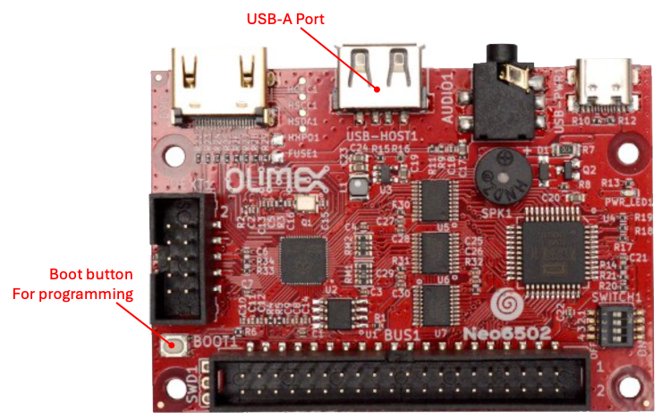
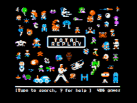

# Programming the RP2040

The process of programming the RP2040 is a fairly easy process, *<u>however</u>*, there is a very specific order to the steps that must be followed to have a successful reprogramming.

**NOTE:** Some firmware images require all switches of the configuration switch block be in the on (closed) position.

## Prerequisites

- Your computer should be on, and you must be logged in and have the desktop present.  Best experience comes with no CPU intensive tasks running on your
  computer.

- You have the latest version of the firmware that you want to use downloaded to your computer. *It is highly recommended that you download the firmware file from the “source of truth” (the developer’s Github repository or website).

- A firmware file comes in various sizes and names, based on the functionality
  it performs, however it will always have the uf2 file extension.

- Make sure the Neo6502 device has been powered down.

## RP2040 programming for the Neo6502

**Required hardware:**

- A computer with a USB port and a modern operating system.

- A Neo6502 computer.

- A USB cable with a USB-A on one end, and the appropriate end that will connect to your computer.

**Steps:**

1. Connect the USB cable between your computer and the Neo6502 USB-A port.  *If you have a USB hub connected or any other device connected to the USB-A port, please
   disconnect it during this process.*

2. Press and hold the "boot" button (bottom left, with the UEXT port on the left and the W6502 bus on the bottom).  *Ensure you have heard or felt the button
   depress with a satisfying “click”.*

3. Turn the power on. 

4. Release the "boot" button.

5. A volume will appear on your computer with the name “RPI-RP2”.

6. Copy the appropriate UF2 file to the “RPI-RP2” volume.

7. **Do not be alarmed**, as soon as the copy is finished, the volume will disappear.  *This indicates that the firmware has been successfully uploaded and programming has
   begun and will only take a few seconds*.

8. Reconnect the USB hub and other devices that were removed on step 1.

## RP2040 programming for the Neo6502pc

**Required hardware:** 

- A computer with a USB port and a modern operating system.

- A Neo6502 computer.

- A USB cable with a USB-C on one end, and the appropriate end that will connect to your computer.

**Steps:**

1. Connect the USB Cable between your computer and the Neo6502 USB-C port (with the LCD facing up, the USB-C port on the left).

2. Slide the programming switch on the back of the Neo6502pc to the programming position (with the switch facing up and in the upper left corner – move to the right-most position).

3. Press and hold the "boot" button (to the left of the programming switch).  *Ensure
   you have heard or felt the button depress with a satisfying “click”.*

4. Continue to press the “boot” button and turn the power on.

5. Release the "boot" button.

6. A volume will appear on your computer with the name “RPI-RP2”.

7. Copy the appropriate UF2 file to the “RPI-RP2” volume.

8. **Do not be alarmed**, as soon as the copy is finished, the volume will disappear.  *This indicates that the firmware has been successfully uploaded and programming has
   begun and will only take a few seconds*.  The Neo6502pc will automatically reboot using the new firmware.

9. Move the programming switch back to “run” position.

## Next Steps:

Based on the firmware that was just flashed, the Neo6502pc will now operate within the firmware function.  Please refer to the documentation that comes with the firmware to know the next steps.   The most popular firmware and their next steps are provided in this document.

### Programming Troubleshooting

- If you are using a Neo6502pc, ensure the programming switch in in the “program” position.

---

# Available Firmware

***The following are accurate as of the September 16th, 2024 revision of this document.***

## NeoBasic (codename: Morpheus)

Maintained by Paul Robson (paul@robsons.org.uk)

GitHub Repository: [GitHub - paulscottrobson/neo6502-firmware: Firmware for a Neo6502 Retrocomputer](https://github.com/paulscottrobson/neo6502-firmware)

Obtain the firmware from the repository link

1. Within the Github respository, navigate to the releases section (right side)

2. Click on the link (release number).   This will take you to the releases list. 

3. Locate and click the zip file to download it.

4. Unzip the file.

5. Locate the “firmware_usb.uf2” file.   *The “*firmware_sd.uf2*” file is used when you are using the SDCard adapter.*

6. Follow the directions ["Programming the RP2040"](#Programming the RP2040) to program the RP2040 with this firmware.

Please refer to the NeoBasic section for more information.

## Apple ][ and //e Emulation

Maintained by Veselin Sladkov (<u>veselin.sladkov@gmail.com</u>)

Obtain the firmware from: [GitHub - vsladkov/reload-emulator: Reload - Portable Retro Computers Emulator](https://github.com/vsladkov/reload-emulator)

The firmware source code is found on the repository; however, it is not compiled into a uf2 file.  You can download the uf2 firmware file from Olimex’s FTP site: [Index of /Neo6502](https://ftp.olimex.com/Neo6502/)

1. Click the link to open the Olimex FTP site.

2. Click and download the “blank_disk_for_apple2e_code_development_apple2e_ProDOS_2_4_3.zip” file.

3. Unzip it, and copy the “ProDOS_2_4_3.po” to a flash drive.

4. Follow the directions ["Programming the RP2040"](#Programming the RP2040) to program the RP2040 with this firmware.

### Working with the Apple ][ and //e Emulation Firmware

You can replace the “ProDOS_2_4_3.po” with other disk images that can be found on the internet.  Check out the Apple ][ section on the Internet Archive ([Internet Archive: Digital Library of Free &amp; Borrowable Books, Movies, Music &amp; Wayback Machine](https://archive.org/details/softwarelibrary_apple_games)) as well as other locations.

## Apple ][ TotalReplay

Maintained by Veselin Sladkov (<u>veselin.sladkov@gmail.com</u>)

Obtain the firmware from: [GitHub - vsladkov/reload-emulator: Reload - Portable Retro Computers Emulator](https://github.com/vsladkov/reload-emulator)

The firmware source code is found on the repository; however, it is not compiled into a uf2 file.  You can download the uf2 firmware file from Olimex’s FTP site: [Index of /Neo6502](https://ftp.olimex.com/Neo6502/)

1. Click the link to open the Olimex FTP site.

2. Click and download two files:
   
   - “Total Replay v5.1.hdv” file.
   
   - “apple2e-5.uf2” file.

3. Copy the “Total Replay v5.1.hdv” to a flash drive.

4. Follow the directions in the section "[Programming the RP2040](/#Programming the RP2040)" to program the RP2040 with this firmware.

If successful, turning on the Neo6502 device, will present you with the TotalReplay title screen.  All games can be played with a keyboard and some games support the USB
gamepad, your milage by vary.  

## Oric Atmos

Maintained by Veselin Sladkov (<u>veselin.sladkov@gmail.com</u>)

Obtain the firmware from: [GitHub - vsladkov/reload-emulator: Reload - Portable Retro Computers Emulator](https://github.com/vsladkov/reload-emulator)

The firmware source code is found on the repository; however, it is not compiled into a uf2 file.

You can download the uf2 firmware file from Olimex’s FTP site: https://ftp.olimex.com/Neo6502/uf2/oric_960x540_372MHz.uf2

This is an older version, and no compiled version with updated firmware is available as a download, as you must have copies of the Oric ROMs.  You will need to compile it yourself or ask folks on social media if an updated compiled version is available.
