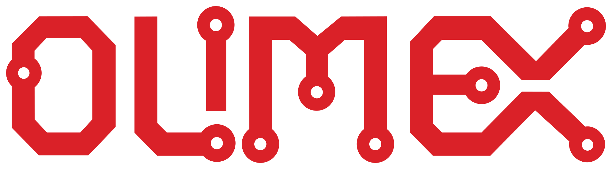

<table width="100%">
  <tr>
    <td align="top" width="35%">
<b>OLIMEX Ltd.</b> 2 Pravda St., P.O. Box 237,  Plovdiv 4000 BULGARIA
    </td>
    <td  width="65%">
      <b>Contact:</b> Mr. Tsvetan Usunov <b>Email:</b> <a href="mailto:info@olimex.com">info@olimex.com</a>  <b>Voice:</b> +359-32-626259, +359-32-267407,  +359-32-621270 
    </td>
  </tr>
  </table>

# Welcome – please read!

Welcome to the modern retro computer world, where you can experience the technology from the 70s and 80s, but with a modern spin on it!

This document covers both the Neo6502 and Neo6502pc computer.  Detailed specifications and the differences between the two can be found in Appendix A.

Neither of the devices (the Neo6502 and Neo6502pc) are turn-key solutions.  Both devi<tabces require intermediate electronics and computer use knowledge.  While both devices have appeared in social media as an out-of-the-box video game platform, it will require that you read this document, so that you gain the best experience!

## Please Note

Regardless of the function you are hoping to utilize the Neo6502 or Neo6502pc, you must be familiar with the process of reprogramming (also known as flashing firmware) the 2MB flash memory utilized by the RP2040.  The firmware defines what function the Neo6502 or Neo6502pc will perform.  Current firmware available provide a BASIC interpreter (NeoBASIC) that is continues to be developed and improved, an Apple ][ emulator (using the real W6502), and an Oric Atmos.  Many and other firmware packages are currently being developed, so explore the various user forums, Discord, and Facebook to discover the endless possibilities of the Neo6502 and Neo6502pc.
 

==> **[Please read the Programming the RP2040 Section](neo6502_start.md)**

**Both devices require that you obtain or supply the following for proper operation:**

**Neo6502**

- USB-C Power Source (5v, 1 amp minimum, more based on peripherals attached).

- A USB cable with a USB-A on one end, and the appropriate end that will connect to your computer *(used to re-program the RP2040)*.

- *Optional,* enclosing case for the Neo6502, *available from Olimex.*

- *Optional*, USB-A Flash Drive (*highly recommend USB3, ~8 GB*), formatted FAT32.

- *Optional*, USB Hub (*Olimex USB-NeoHub is highly recommended for compatibility*).

- *Optional,* USB Gamepad.

**Neo6502pc**

- USB-C Power Source (5v, 1 amp minimum, more based on peripherals attached).

- A USB cable with a USB-C on one end, and the appropriate end that will connect to your computer.

- USB-A Flash Drive (highly recommend USB3, ~8 GB), formatted FAT32.

- USB Keyboard *(wired and wireless w/USB dongle), bluetooth is not supported.*

- *Optional,* USB Gamepad.
