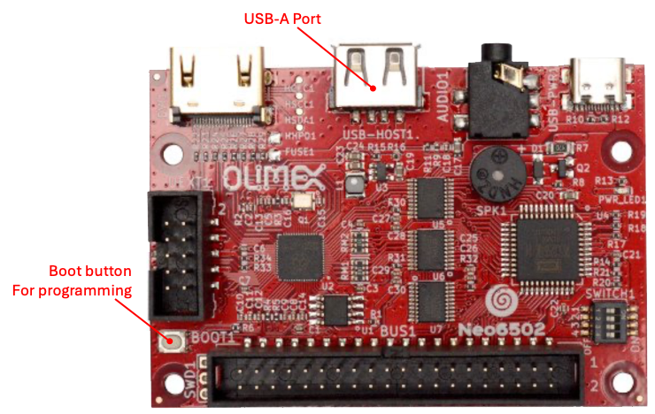
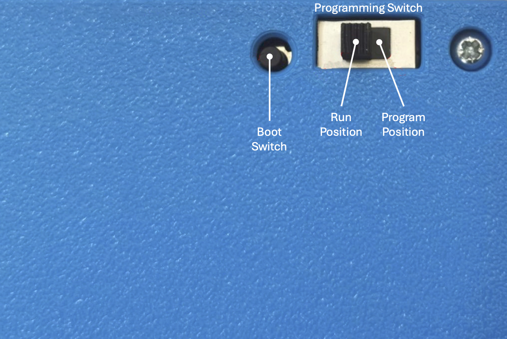

# About the Neo6502

The Neo6502 is a standalone modern retro computer with a real W65C02 processor and RP2040 co-processor.  This small device works 3-times-faster than any of the other recent 6502 competitors and 30-times-faster than 6502 based machines from the 1980s. 

The “Neo” name was used two reasons: First it implies a modern design; Second came
from the analogy with the movie The Matrix where the W65C02 lives in virtual world – thinking it has real memory, video and keyboard – however in reality it is all virtual and emulated with the RP2040.  

Both the Neo6502 and Neo6502pc are [open-source hardware](https://freedomdefined.org/OSHW), with all CAD files and firmware available to support the future development of software and enhancements to the hardware.

There are two models available:

- The Neo6502, an open circuit board computer (2 revisions, A & B).

- The Neo6502pc, a Neo6502 enclosed in a 3D-printed case with a LCD display, USB ports, UEXT and 6502 interface ports and more.

More technical specifications can be found in Appendix A (page 75).  More information about the Neo6502 project, please refer to the Neo6502 website: [www.neo6502.com](http://www.neo6502.com)

## About the W65C02 processor

The W65C02, being a more modern 6502 than the old retro metal oxide semiconductor chip (mos) – in that it can go much faster than was possible in the 1970s and 1980s.  The W65C02 can even be overclocked to 16 MHz, but on the Neo6502 it is running at 6.25 Mhz, which is closer to the clock speed of the Amiga and Atari ST than the Atari or C64, and a lot faster than when most of the retro games were being coded. 

The Neo6502 features a real W65C02S processor, which does all the computing with real timing versus emulation, but the real power of the machine coms from the RP2040
which provides the memory, video, keyboard input, and additional IO for SPI, I2C, UART, and so on.

Things like complex math (multiplication, floating-point) and graphics are also handled by the RP2040, acting like a co-processor.  Unlike other similar architectures, the RP2040 has direct memory access (providing the memory for the 6502) so there are no additional big data transfers between the chips to wait for, making things all much more efficient.

The processor gets 64kb of RAM, but there is 2 MB of flash memory on board, access to USB flash drive for storage via USB or expansion port (for SD card support), and there is a 40-pin connector that offers up a bus of all the 6502 signals and pins that can be used to interface with or use for experiments.  The UEXT ports already support quite a few modules from Olimex that support UEXT specification ([UEXT Modules](https://www.olimex.com/Products/Modules/)).

# Programming the RP2040

The process of programming the RP2040 is a fairly easy process, *<u>however</u>*, there is a very specific order to the steps that must be followed to have a successful reprogramming.

**NOTE:** Some firmware images require all switches of the configuration switch block be in the on (closed) position.

## Prerequisites

- Your computer should be on, and you must be logged in and have the desktop present.  Best experience comes with no CPU intensive tasks running on your
  computer.  

- You have the latest version of the firmware that you want to use downloaded to your computer. *It is highly recommended that you download the firmware file from the “source of truth” (the developer’s Github repository or website).  

- A firmware file comes in various sizes and names, based on the functionality
  it performs, however it will always have the uf2 file extension.  

- Make sure the Neo6502 device has been powered down.

## RP2040 programming for the Neo6502

**Required hardware:**

- A computer with a USB port and a modern operating system.

- A Neo6502 computer.

- A USB cable with a USB-A on one end, and the appropriate end that will connect to your computer.

**Steps:**

1. Connect the USB cable between your computer and the Neo6502 USB-A port.  *If you have a USB hub connected or any other device connected to the USB-A port, please
   disconnect it during this process.*

2. Press and hold the "boot" button (bottom left, with the UEXT port on the left and the W6502 bus on the bottom).  *Ensure you have heard or felt the button
   depress with a satisfying “click”.*

3. Turn the power on. 

4. Release the "boot" button.

5. A volume will appear on your computer with the name “RPI-RP2”.

6. Copy the appropriate UF2 file to the “RPI-RP2” volume.

7. **Do not be alarmed**, as soon as the copy is finished, the volume will disappear.  *This indicates that the firmware has been successfully uploaded and programming has
   begun and will only take a few seconds*.

8. Reconnect the USB hub and other devices that were removed on step 1.

## RP2040 programming for the Neo6502p

**Required hardware:**

- A computer with a USB port and a modern operating system.

- A Neo6502 computer.

- A USB cable with a USB-C on one end, and the appropriate end that will connect to your computer.

**Steps:**

1. Connect the USB Cable between your computer and the Neo6502 USB-C port (with the LCD facing up, the USB-C port on the left).

2. Slide the programming switch on the back of the Neo6502pc to the programming position (with the switch facing up and in the upper left corner – move to the right-most position).

3. Press and hold the "boot" button (to the left of the programming switch).  *Ensure
   you have heard or felt the button depress with a satisfying “click”.*

4. Continue to press the “boot” button and turn the power on.

5. Release the "boot" button.

6. A volume will appear on your computer with the name “RPI-RP2”.

7. Copy the appropriate UF2 file to the “RPI-RP2” volume.

8. **Do not be alarmed**, as soon as the copy is finished, the volume will disappear.  *This indicates that the firmware has been successfully uploaded and programming has
   begun and will only take a few seconds*.  The Neo6502pc will automatically reboot using the new firmware.

9. Move the programming switch back to “run” position.

## Next Steps:

Based on the firmware that was just flashed, the Neo6502pc will now operate within the firmware function.  Please refer to the documentation that comes with the firmware to know the next steps.   The most popular firmware and their next steps are provided in this document.

### Programming Troubleshooting

- If you are using a Neo6502pc, ensure the programming switch in in the “program” position.
